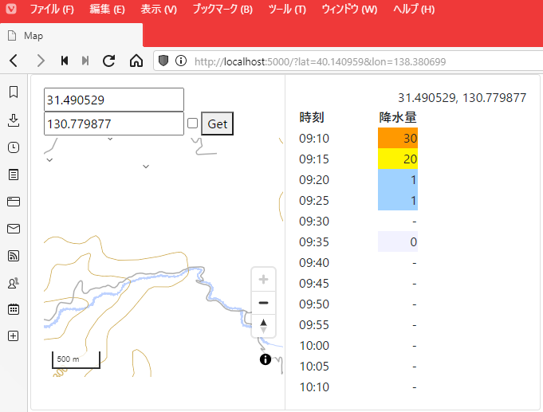
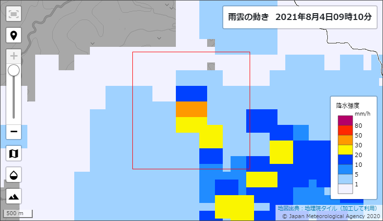

# Selenium-Nowcast

降水ナウキャストから経緯度を指定して JSON / 降水予想画像を取得

---

JSON で返される予報雨量は、指定された経緯度を中心に 2km×2km の範囲のもののうち最大値（ソースコード内で指定）

---

Copyright (c) 2021 YA-androidapp(https://github.com/YA-androidapp) All rights reserved.
